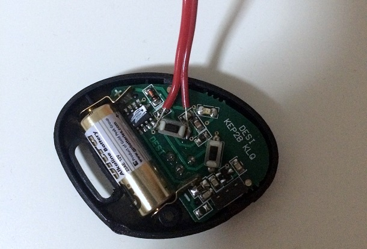
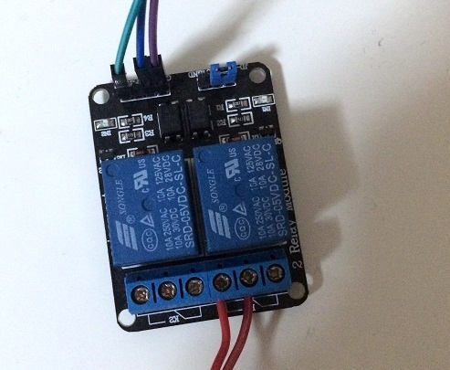
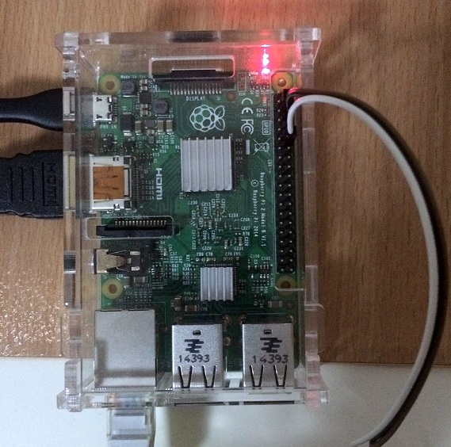

# garageDoor

This is my hobby project. The main idea of the project is opening the garage door by using my mobile phone. 

Required Hardware
- Raspberry pi 2 ~$40
- Single channel relay (I used two channel relay) ~$2.5
- Jumper wires ~$1
- Garage door controller

### Layout

### Hardware Installation

My remote controller is shown in the figure. I soldered a jumper cable both end of the button. These two cables will be connected to relay. The connection of relay and raspberrypi is also easy. Raspberrypi provides 5V and GND outputs for relay. Signal input of relay is the GPIO18 pin for my case.

### Server 

I used Python API of raspberry's GPIO pins and the server is also implemented in Python by using [Flask](http://flask.pocoo.org/). In order to run server, first update the passphrase of your server in the code. Then run;

<code>python doorServer.py</code>

Before server start, you can see the <code>key</code> of your garage door in terminal.

By default server is running on <code>:8080</code> port of your raspberrypi.

You can open your garage door by using following address in browser;

<code>http://< IPofYourRaspberry >:8080/openDoor/< key ></code>

### Network

All you need is a DynamicDNS. There are so many DynamicDNS provides, I used noip.com. 
The client software of your preferred dynamic-DNS server must be installed on your raspberrypi. By using dynamic-DNS, you can continue to use your garage door server event if your internet service provider changes your external IP address.

After that, you need to forward the external port to your raspberrypi by using the control panel of your modem/router. You can used default http port(80) as external port, and external port 80 should be forwarded to internal port 8080 (or your new garage door server port) 

** without network configuration, you can use your system in the same network by using internal IP address of your raspberrypi.

When you all set, just run <code>python doorServer.py</code>

